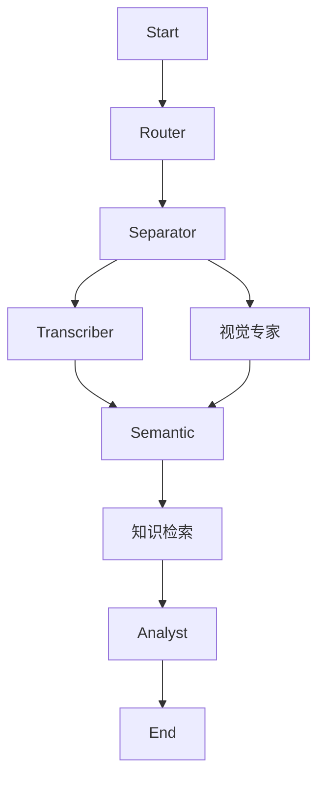

# 实施方案：Phase 4 - 深度优化与 RAG 知识集成

## 1. 背景与目标
当前 **Poly-Muse Analyst** 项目已成功实现了“音频分离 -> 基础转录 -> CLaMP 3 语义标签”的链路。为了进一步提升分析报告的**专业深度**和**多模态感知能力**，本阶段将引入 **RAG (检索增强生成)** 技术和 **频谱视觉分析** 能力。

**核心目标：**
1.  **知识增强 (Knowledge-Augmented)**: 利用 BGE-M3 模型构建本地音乐知识库，使 AI 能够引用专业的音乐理论和历史背景，而非仅依赖 LLM 的通用知识。
2.  **视觉感知 (Visual Perception)**: 引入 Qwen3-VL-Embedding 对音频的 **Mel 频谱图** 进行视觉编码，捕捉音频在频域上的能量分布特征（如“频谱饱满度”、“高频亮度”），为分析提供全新的视觉维度。
3.  **架构治理**: 统一配置管理，确保 6 轨分离模型 (htdemucs_6s) 的稳定运行，清理冗余代码。

## 2. 技术架构升级

### 2.1 新增模块

#### A. 知识专家 (KnowledgeExpert)
*   **职责**: 管理音乐理论知识库，提供语义检索服务。
*   **模型**: `BAAI/bge-m3` (本地部署，GPU 推理)。
*   **数据源**: `data/knowledge/*.md` (需新建，包含音乐流派史、乐器法、和声理论等)。
*   **工作流**:
    1.  初始化时建立/加载 FAISS 向量索引。
    2.  接收查询 (如 "Bebop Jazz characteristics")。
    3.  返回 Top-K 相关知识片段。

#### B. 视觉专家 (VisionExpert)
*   **职责**: 将音频转化为视觉信号并提取特征。
*   **模型**: `Qwen/Qwen3-VL-Embedding` (本地部署，GPU 推理)。
*   **工作流**:
    1.  将音频切片转换为 **Mel 频谱图 (Mel-Spectrogram)**。
    2.  调用多模态 Embedding 模型提取图像特征向量。
    3.  与预设的“频谱形态库” (如“打击乐密集型”、“人声主导型”) 计算相似度。
    4.  输出视觉分析标签。

### 2.2 LangGraph 工作流调整

原流程：
`Separator -> Transcriber -> Semantic -> Analyst`

新流程：

*注：Vision 和 Transcriber 可并行执行（但在 Python 单线程限制下可能仍为串行，除非使用异步）。*

## 3. 详细实施步骤

### 3.1 环境与配置准备
*   **动作**: 清理 `src/config.py`，移除过时的 `BSRoformer` 配置，确立 `htdemucs_6s` 为默认分离模型。
*   **动作**: 添加 `bge-m3` 和 `qwen3-vl` 的模型路径配置。

### 3.2 知识库构建 (RAG)
*   **动作**: 创建 `data/knowledge/` 目录。
*   **动作**: 编写/生成基础音乐理论文档 (Genres, Instruments, Theory)。
*   **动作**: 实现 `src/agents/knowledge.py`，集成 `langchain_community.embeddings.HuggingFaceBgeEmbeddings` 和 `FAISS`。

### 3.3 视觉分析实现
*   **动作**: 实现 `src/agents/vision.py`。
    *   使用 `librosa` 或 `torchaudio` 生成美观的 Mel 频谱图。
    *   集成 `Qwen3-VL-Embedding` 进行图像编码。
*   **动作**: 构建基础的“频谱形态原型库” (Spectrogram Prototypes)。

### 3.4 综合集成
*   **动作**: 更新 `src/workflow.py`，加入新节点。
*   **动作**: 更新 `src/agents/analyst.py`，使其 Prompt 能够利用检索到的知识和视觉标签。

## 4. 预期成果
*   分析报告将包含**“相关音乐理论”**章节，引用具体的知识库内容。
*   分析报告将包含**“频谱视觉特征”**章节，描述音频的能量形态。
*   代码结构更加清晰，配置统一。

## 5. 风险评估
*   **显存压力**: 同时加载 Separator, CLaMP 3, BGE-M3, Qwen3-VL 可能导致显存不足。
    *   **对策**: 采用**动态加载/卸载**策略。每个 Agent 执行完后释放模型显存。
